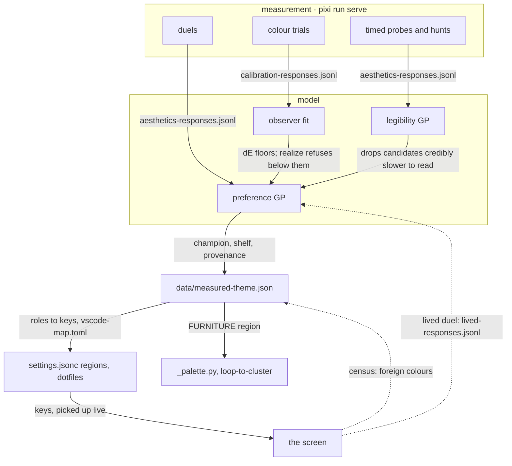
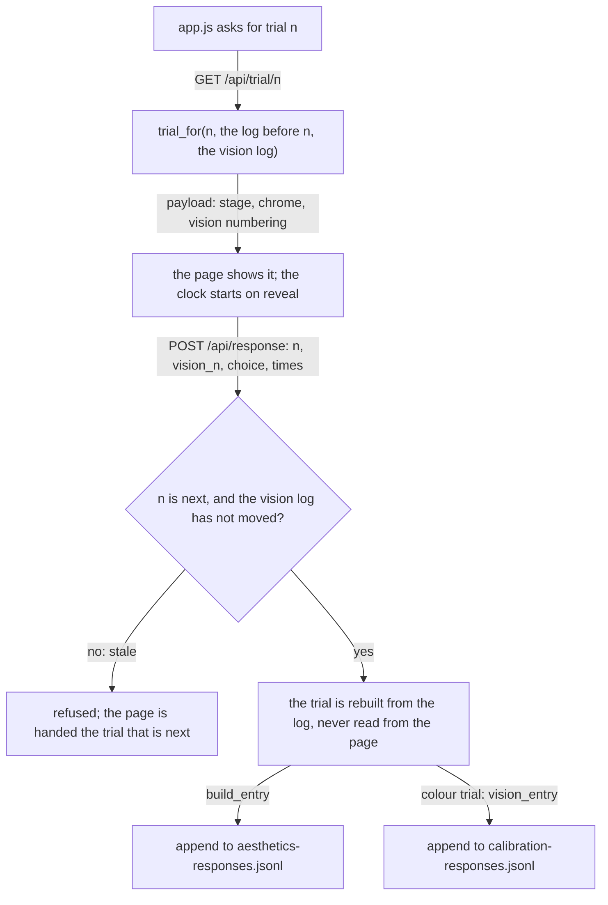
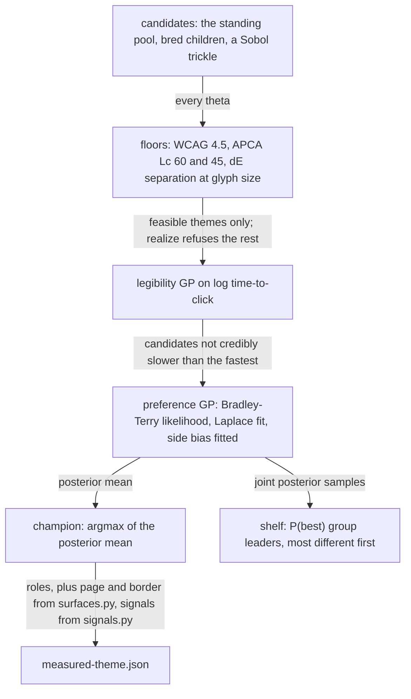
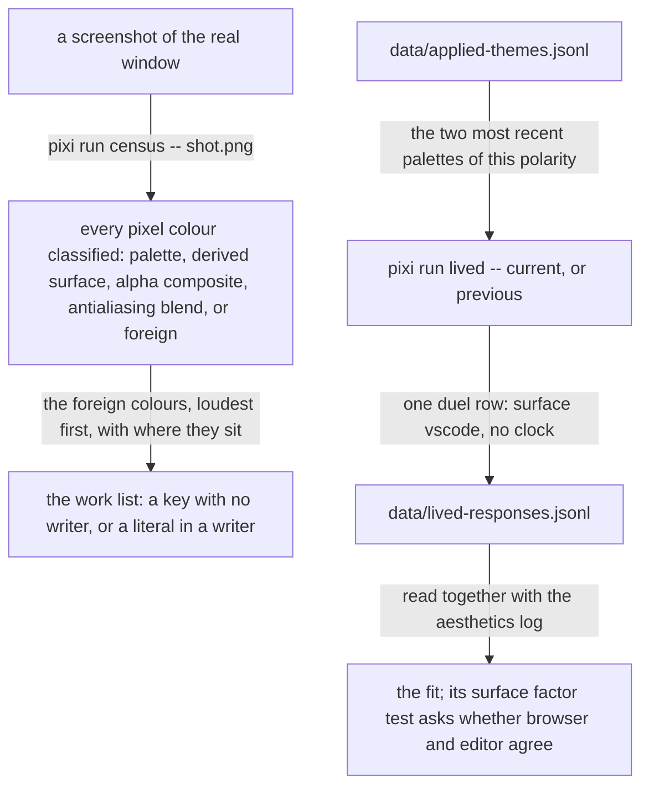

# theme-calibration, the architecture

> **What this is.** The mechanism of theme-calibration for a cold reader: how a click becomes a
> colour on the screen, and how the screen answers back. Drawn, one claim per figure, every
> arrow labelled with what moves; a table wherever a sentence beats a picture. **Who keeps it
> true.** A sibling whose branch changes a component updates the affected figure or row on the
> same branch, in its `Report:` commit; the hippocampus session checks the report against the
> diff at merge. **What tests it.** The reef physical (`physical.py` beside the
> titus-preferences skill in dotfiles) resolves every path and command named here against the
> tree, so a stale report fails the physical instead of misleading a reader. GitHub draws the
> figures from the fences below; the rendered page draws the same text.

## 1. The loop

Measurement produces rows; the model turns rows into a palette; the palette is applied by
writers that live in other repositories; the real screen feeds back twice. Colour arithmetic
happens in this repository only. The appliers map names onto keys and never compute a colour.

*Constraints flow into the preference model; the verdict flows out as one file; the screen returns a census and a lived duel.*

| stage | what happens | where |
| --- | --- | --- |
| measurement | Four arms in one web app, batched into runs. Every answer is one JSON row, append-only, tracked. | `theme/server.py`, `theme/static/app.js`, `data/` |
| model | The observer fit gives colour-difference thresholds. A preferential Gaussian process gives utility; a second one gives reading time. Floors are constraints, never objectives. | `theme/observer.py`, `theme/preference.py`, `theme/legibility.py`, `theme/verdict.py` |
| palette | One published file per polarity with the roles, the derived surfaces, the signals, and the provenance of the measurement it came from. | `pixi run publish` |
| application | Writers outside this repository read the file: the dotfiles applier for VSCode, the viz applier for the notebooks' graph furniture, two dotfiles patches for the literals no key reaches. | `theme/appliers/`, `docs/surfaces.md` |
| loop back | The census names every colour on a real screenshot the palette did not produce. A lived duel records which of the last two applied palettes was better to live in. | `pixi run census`, `pixi run lived` |

## 2. Measurement: four arms, one log discipline

A block is 32 trials: 16 duels, 4 comprehension probes, 4 find hunts, 8 colour trials
(`theme/schedule.py`). Night takes 60% of the blocks. Inside a run one instruction serves many
clicks; a gate opens only the first trial of a sitting and of each run.

| arm | what is shown | what is recorded | log |
| --- | --- | --- | --- |
| duel | two candidate pages of fresh code, split viewport, each in its own ground | which side won, reaction time, the swap flag, the surface | `data/aesthetics-responses.jsonl` |
| comprehension probe | one page; click the named function at a call site | time to the click, whether it landed | same |
| find hunt | one page with matches highlighted; click the current one | time to the click; the highlight's salience is the axis under test | same |
| colour trial | four squares on one ground, three of one colour and one of another, at 16 or 10 px | the odd square chosen, reaction time, the input method | `data/calibration-responses.jsonl`, plus a pointer row in the aesthetics log |

The instrument's chrome never wears the theme under test, and its ink is chosen per trial
against the painted surround (`theme/server.py`). The code pages are generated fresh per trial
(`theme/codegen.py`, `theme/stimulus.py`); a page shown twice would measure memory.

*A row describes the stimulus that was actually shown because the recorder rebuilds it from the log; an answer to a trial that is no longer next is refused, not written to the wrong row.*

Trial generation is a pure function of the trial number and the rows before it
(`theme/schedule.py`, `theme/trialspec.py`, `theme/vision.py`), which is what makes the rebuild
honest. The log is an object holding a path (`theme/responses.py`), so `tests/test_click_path.py`
answers 33 consecutive trials through the real app against a temporary file.

## 3. Model: constraints first, preference second

*A theme reaches the preference verdict only after it has cleared the perceptual floors and the legibility surface; the champion and the shelf are two different readings of the same posterior.*

| module | owns |
| --- | --- |
| `theme/observer.py` | the one observer model, fit from the colour-trial log and cached in `data/observer-fit.json`; every threshold in the project reads this fit |
| `theme/thresholds.py` | the floors derived from that fit, and the regime that says whether the size exponent is measured or a prior |
| `theme/space.py` | the nine axes, the anchors, the prior, and `realize`, which builds a palette from a point or refuses |
| `theme/color.py`, `theme/harmony.py` | CAM16-UCS arithmetic and the contrast floors; the Ou and Luo harmony term, transcribed |
| `theme/kernel.py`, `theme/preference.py`, `theme/legibility.py`, `theme/breeding.py`, `theme/diagnostics.py` | the two Gaussian processes, the candidate set, and the readouts that say when to believe a number; `theme/model.py` is their import surface |
| `theme/verdict.py` | the answer as one object per polarity; `theme/publish.py` prints it (`pixi run verdict`) or writes it (`pixi run publish`); `notebooks/analysis.py` only words it |
| `theme/inverse.py` | the nearest theta to a palette that was never a point in the space, so a hand-chosen layer can be duelled inside the model |

## 4. The palette file

`pixi run publish` writes `data/measured-theme.json`, one object per polarity. It is derived
and untracked; the logs it is computed from are tracked. Dotfiles reads it through a symlink
(`~/dotfiles/home/theme/palettes/measured.json`).

| field | what it is | computed by |
| --- | --- | --- |
| `ground`, `ink`, `comment`, `punct`, `keyword`, `function`, `string`, `find_fill` | the champion's roles | `theme/verdict.py` |
| `page`, `border` | the two surfaces the elevation system derives from the ground, at the steps read off the hand-chosen Horizon values | `theme/surfaces.py` |
| `signals` | error, warning, success, info, the git hues, the sixteen ANSI colours: the world's hue at the accents' chroma, walked to the body-text floor on this ground | `theme/signals.py` |
| `theta`, `p_best`, `verdict`, `n_duels` | where the champion sits in the space, how much of the probability of being best it holds, whether that is a single leader or a plateau | `theme/verdict.py` |
| `provenance` | the code revision, the fit fingerprint, the observer model and its regime, the reaction-time exponent, the timestamp | `theme/verdict.py` |

## 5. Application: four kinds of colour, one writer each

Every colour on a screen is one of four kinds, and each kind has exactly one writer. The
per-surface contract, with the pixel check for each row, is `docs/surfaces.md`;
`tests/test_appliers.py` fails when a row names a writer that does not exist.

| class | what it is | decided by | written by |
| --- | --- | --- | --- |
| furniture | paper, page, border, the ink family; carries no meaning | the ground, through `theme/surfaces.py` | the dotfiles applier's workbench regions (`~/dotfiles/home/editors/vscode/apply-measured-theme.py`); the notebooks' graph furniture by `theme/appliers/viz.py` |
| controls | the one accent every button, badge, link and focus ring shares | the function colour | the dotfiles applier; the chat panel's two literals by `~/dotfiles/home/editors/vscode/patches/claude_code_composer_theme.py` |
| signals | error red, warning orange, success green, info blue, git, the ANSI set | `theme/signals.py` | the dotfiles applier's signals regions; marimo's remaining literals by `~/dotfiles/home/editors/vscode/patches/marimo_theme_vars.py` |
| data | ramps, categorical sets, the polarity pair | discriminability under the fitted observer at mark size, ranked in `notebooks/gallery.py` | nobody downstream: `theme/appliers/viz.py` refuses any write that would change them |
| syntax | keyword, function, string, comment, punctuation on tokens | the measured palette itself | the dotfiles applier's semantic and textMate regions |

The dotfiles applier reads the palette through the theming map `~/dotfiles/home/theme/vscode-map.toml`
and rewrites marked regions of `~/dotfiles/home/editors/vscode/settings.jsonc`, retiring any
hand-written line for a key it owns; VSCode picks the file up live. It appends every application,
palette and provenance included, to `data/applied-themes.jsonl`. The viz applier keeps the same
marker discipline (`theme/appliers/regions.py`) in a Python target: the rewritten module is
compiled and executed before anything is written, and refused if an owned name is missing or a
data palette changed.

## 6. The loop back

*The census closes the loop on coherence; the lived duel closes it on the thing a four-second look cannot see, fatigue over a day.*

## 7. Where things live, and what protects them

| place | holds |
| --- | --- |
| `theme/` | the instrument as a plain package; each module's docstring says what it owns and why it is separate |
| `notebooks/` | the reading half: `notebooks/analysis.py` words the verdict, `notebooks/vision.py` runs a clockless colour sitting and reads the thresholds, `notebooks/gallery.py` ranks palettes under the fitted observer. Each has a task (`pixi run analyse`, `pixi run vision`, `pixi run gallery`) so no editor picks the wrong interpreter |
| `data/` | the four append-only logs, tracked; the published palette and the observer caches, derived and untracked |
| `tests/` | recovery tests that plant a truth and check it comes back; Hypothesis property tests over the whole space (`tests/test_realization.py`); the click path through the real app; static contracts over the notebooks (`tests/test_notebook_contracts.py`); the applier and surface contracts |
| `docs/surfaces.md` | the surface contract: what each surface reads, its role and class, its writer, its pixel check |
| `.claude/skills/theme-design/SKILL.md` | the method reef: every experimental-design rule earned by a measurement, the aesthetics theory in operational form, the standing verdicts |
| `CONTRIBUTING.md`, `CLAUDE.md` | the engineering contract and the router, including where the work stands |

Green means `pixi run check` and `pixi run test`, all of it. Nothing in the path a click takes
imports a notebook, and no notebook computes a number anyone acts on.
